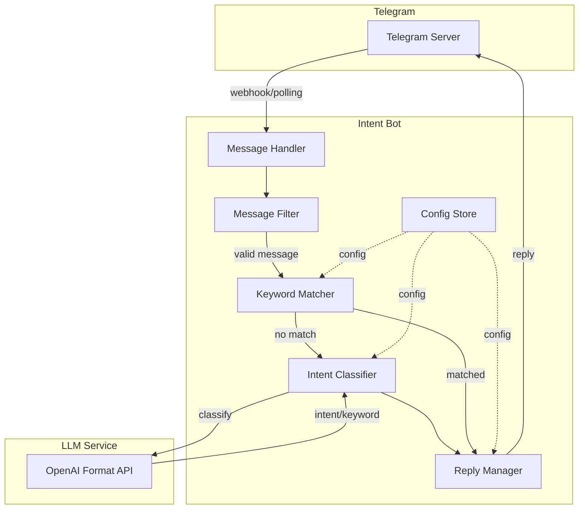
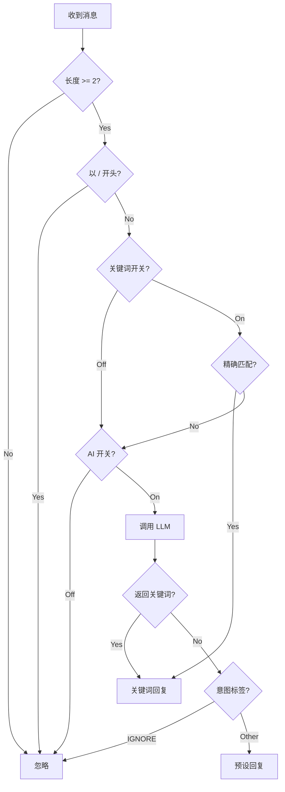

# Design Document

## Overview

本系统是一个基于 Python 的 Telegram 群聊智能意图识别机器人，采用"AI 仅做判官，不做写手"的核心原则。系统使用 python-telegram-bot 库监听消息，通过双重关键词匹配（精确匹配 + AI 辅助识别）和 LLM 意图分类，使用预设话术进行回复。

技术栈：
- 语言：Python 3.11+
- Telegram：python-telegram-bot (Bot API)
- LLM：OpenAI 格式 API（支持任意第三方服务）
- 部署：Docker + docker-compose
- 配置：YAML 文件

## Architecture



### 消息处理流程



## Components and Interfaces

### 1. ConfigStore - 配置管理

```python
@dataclass
class LLMConfig:
    base_url: str      # API 地址
    api_key: str       # API 密钥
    model: str         # 模型名称
    temperature: float = 0.0

@dataclass
class BotConfig:
    token: str                    # Telegram Bot Token
    keyword_reply_enabled: bool   # 关键词回复开关
    ai_reply_enabled: bool        # AI 回复开关

@dataclass
class IntentConfig:
    tag: str           # 意图标签
    description: str   # 触发场景描述
    reply: str         # 预设回复内容

@dataclass
class KeywordConfig:
    keyword: str       # 关键词
    reply: str         # 回复内容

@dataclass
class FAQConfig:
    faq_id: str        # FAQ 唯一标识
    question: str      # 问题描述（供 LLM 判断）
    answer: str        # 预设答案

class ConfigStore:
    def load(self, path: str) -> None: ...
    def get_bot_config(self) -> BotConfig: ...
    def get_llm_config(self) -> LLMConfig: ...
    def get_intents(self) -> list[IntentConfig]: ...
    def get_keywords(self) -> list[KeywordConfig]: ...
    def get_faqs(self) -> list[FAQConfig]: ...
    def get_reply_by_intent(self, tag: str) -> str | None: ...
    def get_reply_by_keyword(self, keyword: str) -> str | None: ...
    def get_reply_by_faq_id(self, faq_id: str) -> str | None: ...
```

### 2. KeywordMatcher - 关键词匹配器

```python
class KeywordMatcher:
    def __init__(self, keywords: list[KeywordConfig]): ...
    
    def match(self, text: str) -> str | None:
        """精确匹配关键词，返回第一个匹配的关键词，无匹配返回 None"""
        ...
```

### 3. LLMClient - 大模型客户端

```python
@dataclass
class ClassifyResult:
    intent: str           # 意图标签
    keyword: str | None   # 识别的关键词（可选）
    faq_id: str | None    # 匹配的 FAQ ID（可选）

class LLMClient:
    def __init__(self, config: LLMConfig): ...
    
    async def classify(self, message: str, intents: list[IntentConfig], 
                       keywords: list[str], faqs: list[FAQConfig]) -> ClassifyResult:
        """调用 LLM 进行意图分类，返回意图标签、可选关键词和可选 FAQ ID"""
        ...
```

### 4. IntentClassifier - 意图分类器

```python
class IntentClassifier:
    def __init__(self, llm: LLMClient, config: ConfigStore): ...
    
    async def classify(self, message: str) -> ClassifyResult:
        """分类消息意图，处理异常返回 IGNORE"""
        ...
```

### 5. ReplyManager - 回复管理器

```python
class ReplyManager:
    def __init__(self, config: ConfigStore): ...
    
    def get_reply(self, result: ClassifyResult) -> str | None:
        """根据分类结果获取回复内容，IGNORE 返回 None"""
        ...
```

### 6. MessageHandler - 消息处理器

```python
class MessageHandler:
    def __init__(self, config: ConfigStore, keyword_matcher: KeywordMatcher,
                 classifier: IntentClassifier, reply_manager: ReplyManager): ...
    
    async def handle(self, update: Update, context: ContextTypes.DEFAULT_TYPE):
        """处理 Telegram 消息，执行完整流程"""
        ...
```

## Data Models

### 配置文件结构 (config.yaml)

```yaml
bot:
  token: "YOUR_BOT_TOKEN"
  keyword_reply_enabled: true
  ai_reply_enabled: true

llm:
  base_url: "https://api.example.com/v1"
  api_key: "YOUR_API_KEY"
  model: "gpt-3.5-turbo"

intents:
  - tag: "TUTORIAL"
    description: "用户询问教程、说明书、如何使用、第一步做什么"
    reply: "📖 新手指南：\n1. 点击置顶消息查看教程\n2. 访问官网获取详细文档"
  - tag: "ISSUE"
    description: "用户反馈报错、Bug、无法运行、卡住"
    reply: "🛠 故障排查：\n请尝试重启应用，如果无效请截图发送给我们"
  - tag: "SERVICE"
    description: "用户寻找人工客服、群主、投诉"
    reply: "👤 客服在线时间：9:00-18:00\n请联系 @Admin"
  - tag: "IGNORE"
    description: "闲聊、表情包、无关内容、负面情绪发泄"
    reply: ""

keywords:
  - keyword: "教程"
    reply: "📖 新手指南：请查看置顶消息"
  - keyword: "客服"
    reply: "👤 请联系 @Admin"
  - keyword: "bug"
    reply: "🛠 请描述问题并截图"

faq:
  - faq_id: "register"
    question: "如何注册账号、注册流程、怎么注册"
    answer: "📝 注册步骤：\n1. 访问官网点击注册\n2. 填写手机号获取验证码\n3. 设置密码完成注册"
  - faq_id: "forgot_password"
    question: "忘记密码、密码找回、重置密码"
    answer: "🔑 密码找回：\n1. 点击登录页的「忘记密码」\n2. 输入注册手机号\n3. 通过短信验证重置密码"
  - faq_id: "pricing"
    question: "价格、收费、多少钱、费用"
    answer: "💰 价格说明：\n基础版免费，专业版 99 元/月\n详情请访问官网定价页面"
```

### LLM 请求/响应格式

System Prompt:
```
你是一个意图分类器。根据用户消息，判断其意图并返回 JSON 格式结果。

可用意图标签：
- TUTORIAL: 用户询问教程、说明书、如何使用
- ISSUE: 用户反馈报错、Bug、无法运行
- SERVICE: 用户寻找人工客服、群主、投诉
- FAQ: 用户询问常见问题（见下方 FAQ 列表）
- IGNORE: 闲聊、表情包、无关内容

可用关键词：教程, 客服, bug

FAQ 列表：
- register: 如何注册账号、注册流程、怎么注册
- forgot_password: 忘记密码、密码找回、重置密码
- pricing: 价格、收费、多少钱、费用

规则：
1. 只输出 JSON，不要任何解释
2. 如果消息明确匹配某个关键词的语义，在 keyword 字段返回该关键词
3. 如果消息匹配某个 FAQ，返回 intent 为 "FAQ"，并在 faq_id 字段返回对应 ID
4. FAQ 优先级高于普通意图标签
5. 否则只返回 intent 字段

输出格式：{"intent": "TAG", "keyword": "关键词或null", "faq_id": "FAQ_ID或null"}
```

Response:
```json
{"intent": "TUTORIAL", "keyword": null, "faq_id": null}
```
或
```json
{"intent": "FAQ", "keyword": null, "faq_id": "register"}
```
或
```json
{"intent": "TUTORIAL", "keyword": "教程", "faq_id": null}
```


## Correctness Properties

*A property is a characteristic or behavior that should hold true across all valid executions of a system—essentially, a formal statement about what the system should do. Properties serve as the bridge between human-readable specifications and machine-verifiable correctness guarantees.*


### Property 1: 消息过滤规则

*For any* 消息文本，如果长度小于 2 或以 "/" 开头，则该消息应被忽略，不触发任何回复逻辑。

**Validates: Requirements 1.3, 1.4**

### Property 2: JSON 解析健壮性

*For any* LLM 返回的字符串，如果是有效 JSON 且包含有效意图标签，则应正确解析；否则应返回 IGNORE 标签。

**Validates: Requirements 2.3, 2.4**

### Property 3: 意图标签有效性

*For any* 分类结果，返回的意图标签必须是 TUTORIAL、ISSUE、SERVICE、IGNORE、FAQ 之一。

**Validates: Requirements 2.5**

### Property 4: IGNORE 静默规则

*For any* 分类结果为 IGNORE 的情况，Reply_Manager 应返回 None，不产生任何回复。

**Validates: Requirements 3.4**

### Property 5: 配置加载与验证

*For any* 有效的 YAML 配置文件，Config_Store 应能正确加载；对于无效配置，应抛出明确的错误。

**Validates: Requirements 4.1, 4.2**

### Property 6: 意图回复完整性

*For any* 有效意图标签（非 IGNORE），Config_Store 应能提供对应的非空预设回复内容。

**Validates: Requirements 4.4**

### Property 7: 错误处理降级

*For any* LLM 调用失败或返回无效数据的情况，系统应返回 IGNORE 标签，确保不会因异常而崩溃。

**Validates: Requirements 2.4, 5.6**

### Property 8: 关键词精确匹配

*For any* 消息文本和关键词列表，如果消息包含某个关键词，应返回第一个匹配的关键词；如果匹配多个，返回配置顺序中的第一个。

**Validates: Requirements 7.2, 7.3**

### Property 9: 关键词优先于 AI 回复

*For any* 同时匹配关键词和 AI 分类结果的情况，如果 AI 返回了关键词，应优先使用关键词字典的回复。

**Validates: Requirements 2.7**

### Property 10: 开关控制行为

*For any* 消息处理流程：
- 当 AI 开关关闭时，不应调用 LLM
- 当关键词开关关闭时，不应进行关键词匹配
- 当两个开关都关闭时，不应产生任何回复

**Validates: Requirements 8.3, 8.4, 8.5**

### Property 11: FAQ 匹配与回复

*For any* 分类结果为 FAQ 且 faq_id 有效的情况，Reply_Manager 应返回该 FAQ 的预设答案；如果 faq_id 无效，应回退到 IGNORE 处理。

**Validates: Requirements 10.3, 10.4**

### Property 12: FAQ 与意图分类同步

*For any* LLM 调用，FAQ 匹配和意图分类应在同一次请求中完成，不增加额外的 API 调用。

**Validates: Requirements 10.7**

## Error Handling

### 错误类型与处理策略

| 错误类型 | 处理策略 | 日志级别 |
|---------|---------|---------|
| 配置文件不存在 | 启动失败，抛出异常 | ERROR |
| 配置格式错误 | 启动失败，抛出异常 | ERROR |
| LLM API 调用失败 | 返回 IGNORE，记录日志 | WARNING |
| LLM 返回无效 JSON | 返回 IGNORE，记录日志 | WARNING |
| LLM 返回无效标签 | 返回 IGNORE，记录日志 | WARNING |
| Telegram API 失败 | 重试一次，失败则记录日志 | ERROR |
| 网络超时 | 返回 IGNORE，记录日志 | WARNING |

### 异常处理代码模式

```python
async def classify(self, message: str) -> ClassifyResult:
    try:
        response = await self._call_llm(message)
        return self._parse_response(response)
    except json.JSONDecodeError as e:
        logger.warning(f"Invalid JSON from LLM: {e}")
        return ClassifyResult(intent="IGNORE", keyword=None)
    except Exception as e:
        logger.warning(f"LLM call failed: {e}")
        return ClassifyResult(intent="IGNORE", keyword=None)
```

## Testing Strategy

### 单元测试

使用 pytest 进行单元测试，覆盖以下模块：

1. **ConfigStore**: 配置加载、验证、查询
2. **KeywordMatcher**: 精确匹配、多匹配优先级
3. **LLMClient**: 请求构建、响应解析
4. **IntentClassifier**: 分类逻辑、错误处理
5. **ReplyManager**: 回复获取、优先级处理
6. **MessageHandler**: 消息过滤、流程控制

### 属性测试

使用 hypothesis 进行属性测试，验证核心正确性属性：

```python
from hypothesis import given, strategies as st

@given(st.text(max_size=1))
def test_short_messages_ignored(text):
    """Property 1: 短消息应被忽略"""
    assert should_ignore_message(text) == True

@given(st.text().filter(lambda x: x.startswith('/')))
def test_command_messages_ignored(text):
    """Property 1: 命令消息应被忽略"""
    assert should_ignore_message(text) == True
```

### 测试配置

- 属性测试最少运行 100 次迭代
- 每个属性测试需标注对应的设计属性编号
- 标注格式：**Feature: telegram-intent-bot, Property N: 属性描述**
